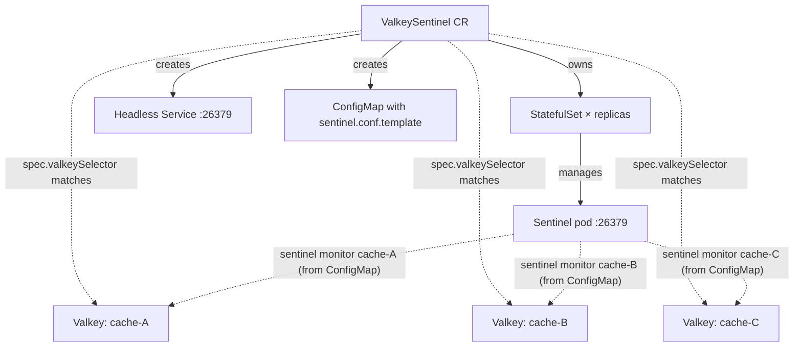

# ValkeySentinel

`ValkeySentinel` deploys a standalone set of Valkey Sentinel processes
that monitor every [`Valkey`](./valkey.md) in the same namespace
whose labels match `spec.valkeySelector`.

The link is one-way: the sentinel picks its targets. The Valkey side
is unaware of monitoring beyond an observed `status.monitoredBy`
field.

## Quickstart

```yaml
apiVersion: valkey.io/v1alpha1
kind: ValkeySentinel
metadata:
  name: monitors
spec:
  replicas: 3
  valkeySelector:
    matchLabels:
      tier: caching
  config:
    down-after-milliseconds: "30000"
    failover-timeout: "180000"
    parallel-syncs: "1"
```

Apply alongside one or more `Valkey` CRs whose labels include
`tier: caching` and the sentinels will monitor them all from a single
3-pod set.

## Features

### `replicas` (minimum 3)

Three is the smallest set where one pod loss still leaves a quorum of
two. For a fleet that needs to monitor many masters, scale this set up
independently of any one Valkey's replica count.

### `valkeySelector` (required)

Standard `metav1.LabelSelector` (`matchLabels` and/or
`matchExpressions`). Same-namespace only.

Every `Valkey` in this namespace whose labels match is monitored.
Every `Valkey` that ceases to match (e.g. a label was removed) gets
`SENTINEL REMOVE`-d on the next reconcile - **immediately**, no grace
period.

### `config` (per-master tuning baked into the template)

```yaml
config:
  down-after-milliseconds: "30000"
  failover-timeout: "180000"
  parallel-syncs: "1"
```

These keys are written as `sentinel <key> <master> <value>` lines into
the rendered `sentinel.conf` template for every monitored master, then
materialized into the sentinel pods' working directory at boot.

The operator does **not** issue `SENTINEL SET` against running
sentinels in steady state - the ConfigMap is the source of truth. When
the rendered content changes, a content-hash annotation on the
StatefulSet pod template triggers a rolling restart (one pod at a
time, respecting the PDB) so the new config reaches the pods without
the burst of CONFIG REWRITE writes that can stall the sentinel timer.

Global to all monitored masters in this version; per-master overrides
are future work.

### `quorum` (optional)

Defaults to `floor(replicas/2)+1` (a strict majority of the sentinel
set). Must be ≤ `replicas`.

### Resources, scheduling, PDB

Standard. Anti-affine the sentinel pods across hosts or zones so a
node failure does not take the whole set down with the data it
monitors.

## How auth works

Each `Valkey` selected by a `ValkeySentinel` exposes a small
`<name>-sentinel-auth` Secret containing the credentials for the
`_sentinel` ACL user. The sentinel controller aggregates the passwords
from every matched Valkey into a single `<sentinel-name>-auth` Secret,
mounted read-only at `/sentinel-auth/` in every sentinel pod (one file
per Valkey, keyed by the Valkey name).

The rendered `sentinel.conf` carries a `__SENTINEL_AUTH_PASS_<name>__`
placeholder. The startup script substitutes each placeholder with the
contents of the matching file at pod start, so the password is never
written to a ConfigMap or pod environment variable.

If multiple `ValkeySentinel`s select the same `Valkey`, each renders
its own copy of the master into its own ConfigMap. The Valkey emits a
`MultipleSentinelsSelecting` warning event so the situation is
visible; behaviour is undefined.

## Status

```yaml
status:
  state: Ready
  readyReplicas: 3
  monitored:
    - cache-A
    - cache-B
    - cache-C
  endpoints:
    - host: valkey-sentinel-monitors-0.valkey-sentinel-monitors.cache.svc.cluster.local
      port: 26379
    - host: valkey-sentinel-monitors-1.valkey-sentinel-monitors.cache.svc.cluster.local
      port: 26379
    - host: valkey-sentinel-monitors-2.valkey-sentinel-monitors.cache.svc.cluster.local
      port: 26379
```

`monitored` is the de-duplicated list of masters the sentinels are
currently monitoring (from `SENTINEL masters` filtered by selector
match).

`endpoints` is the per-pod sentinel address list (see
[Connecting clients](#connecting-clients) for usage).

## Connecting clients

Sentinel-aware clients accept a list of sentinel endpoints and try each
in order. The operator surfaces all of them in
`status.endpoints` so a single sentinel being unreachable doesn't
strand a client's bootstrap connect.

Each entry is the per-pod StatefulSet DNS name
(`<sentinel-name>-<index>.<sentinel-name>.<namespace>.svc.cluster.local`)
on the sentinel port `26379`. The headless governing Service publishes
these names from pod creation, so the list is correct even before all
pods report Ready.

Read the addresses from the CR and pass them to your client of choice:

```bash
kubectl get valkeysentinel monitors -n cache \
  -o jsonpath='{range .status.endpoints[*]}{.host}:{.port}{"\n"}{end}'
```

`go-redis` (Sentinel-aware client):

```go
import "github.com/redis/go-redis/v9"

rdb := redis.NewFailoverClient(&redis.FailoverOptions{
    MasterName: "cache-A",
    SentinelAddrs: []string{
        "valkey-sentinel-monitors-0.valkey-sentinel-monitors.cache.svc.cluster.local:26379",
        "valkey-sentinel-monitors-1.valkey-sentinel-monitors.cache.svc.cluster.local:26379",
        "valkey-sentinel-monitors-2.valkey-sentinel-monitors.cache.svc.cluster.local:26379",
    },
    SentinelUsername: "_sentinel",
    SentinelPassword: sentinelPassword,
})
```

`SentinelUsername` / `SentinelPassword` come from the per-`Valkey`
`<name>-sentinel-auth` Secret (the `_sentinel` ACL user the operator
provisions on the data side). The client uses them to authenticate
its `SENTINEL get-master-addr-by-name` call before talking to the
data nodes.

## Planned failover (rollout)

When a planned rollout needs to demote the current primary (e.g. to
roll its pod last so it stays serving traffic the longest), the
operator issues `SENTINEL FAILOVER <name>` against one of the
sentinels selecting this Valkey.

On Valkey **9.0+** sentinels the operator uses the **COORDINATED**
form ([valkey-io/valkey#1292](https://github.com/valkey-io/valkey/pull/1292)):
the chosen replica catches up via the master's `FAILOVER` command
before the role flip, so the remaining replicas continue with `psync`
afterwards instead of taking a full resync. For non-trivial datasets
this is the difference between a sub-second hiccup and minutes of
replica unavailability.

If the running sentinel rejects the `COORDINATED` keyword (pre-9.0),
the operator falls back to the plain form and emits a
`RolloutFailoverFallback` event recommending the upgrade. The rollout
still succeeds; replicas just take the full-resync path.

## Constraints

- Same-namespace label selector only. No cross-namespace.
- Standalone Valkeys (`replicas: 0`) are skipped by the selector even
  if their labels match - there's no replication to fail over.
- TLS for the sentinel port is reserved but not yet implemented.

## Architecture


